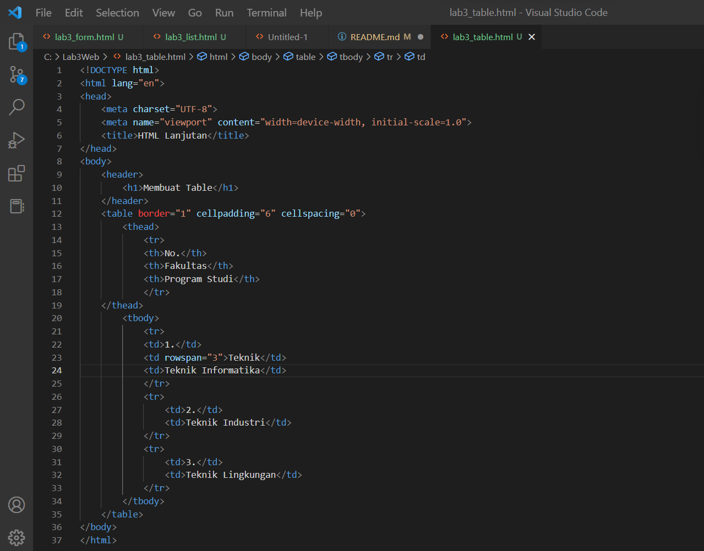

# Lab3WEB
## Langkah - Langkah Praktikum
### Membuat Ordered List
Buat file baru dengan extension HTML dan buatlah code seperti gambar berikut

### Membuat Unordered List
Langkah berikutnya tambah code,setelah deklarasi ordered list pada section Unordered List pada file yang sama ikuti dengan code yang ada pada gambar berikut

### Membuat Description List
Tambahkan code untuk membuat description list setelah deklarasi unordered List

### Membuat Tabel
Buat file baru dengan nama lab3_tabel.html, Selanjutnya tambahkan code untuk membuat tabel sederhana seperti gambar berikut

[Output Tabel](Screenshot/Outputtabel.png)
### Mengatur Margin dan Padding
Untuk mengatur Margin dan Padding pada cell data, tambahkan atribut cellpadding dan cellspacing pada tag table. `<table border="1"cellpadding="6" cellspacing="0">`

### Menggabungkan Sel Data
Untuk menggabungkan sel data, gunakan atribut Rowspan dan Colspan. Atribut berfungsi untuk menggabungkan baris (secara vertikal) dan Colspan berfungsi untuk menggabungkan kolom (secara horizontal)

### Mebuat Form
Buat file baru seperti gambar berikut

Selanjutnya tambahkan kode untuk membuat tabel sederhana pada file form seperti gambar berikut

### Menambahkan Style Pada Form
Supaya tampilan form lebih menarik, bisa ditambahkan CSS seperti gambar berikut

